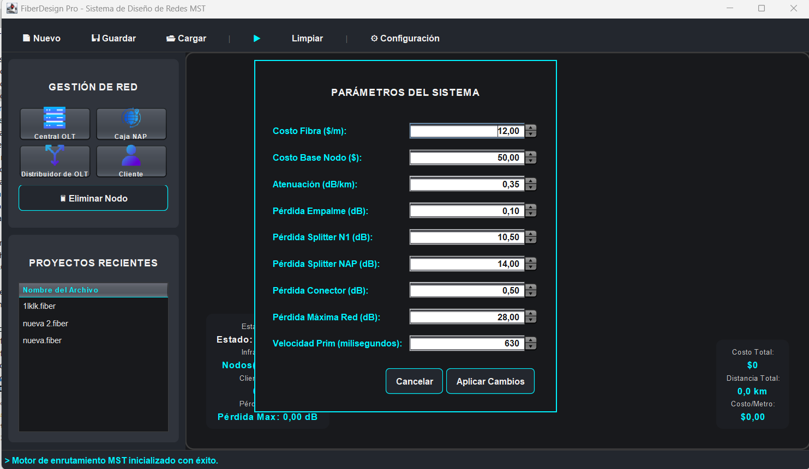
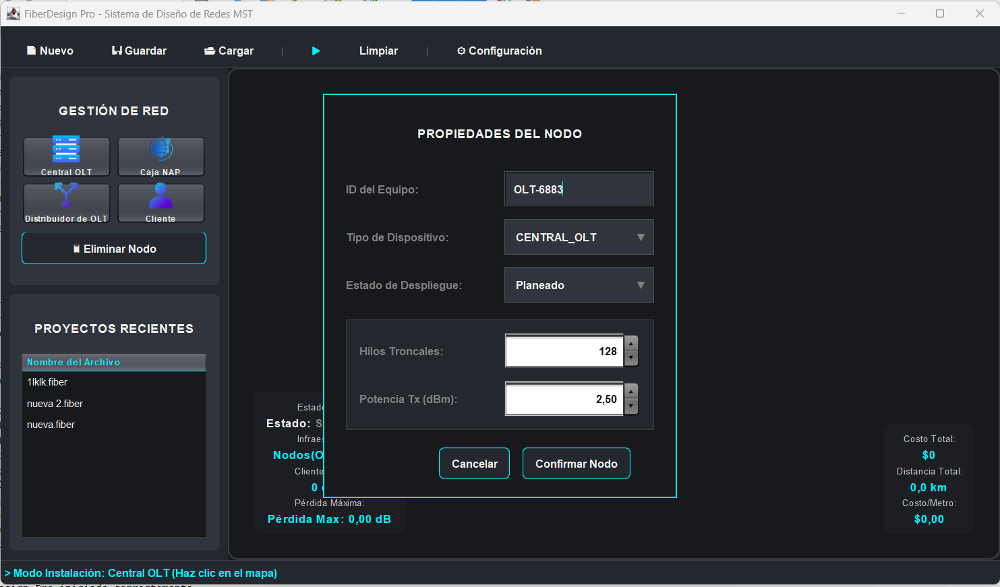
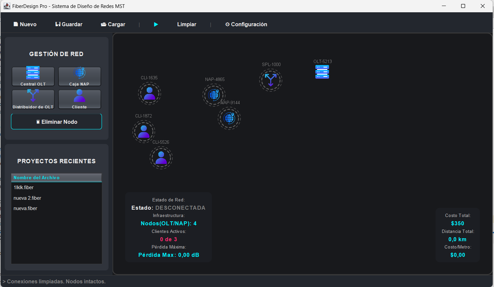
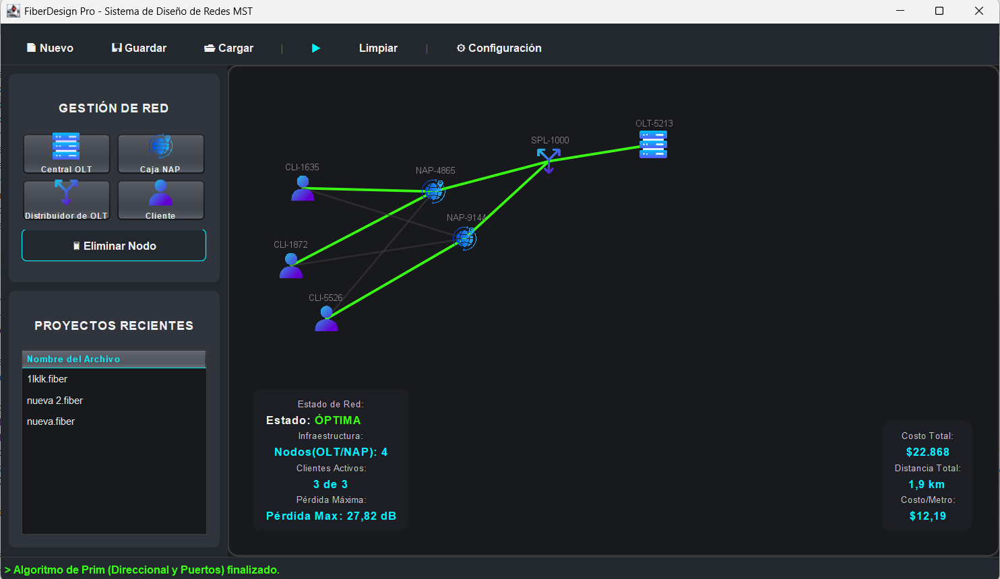
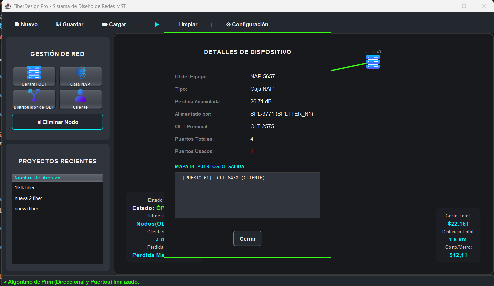
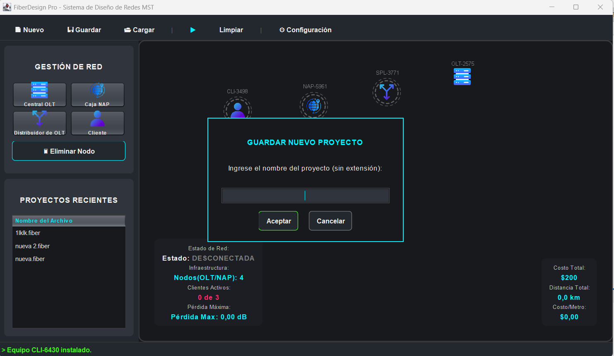
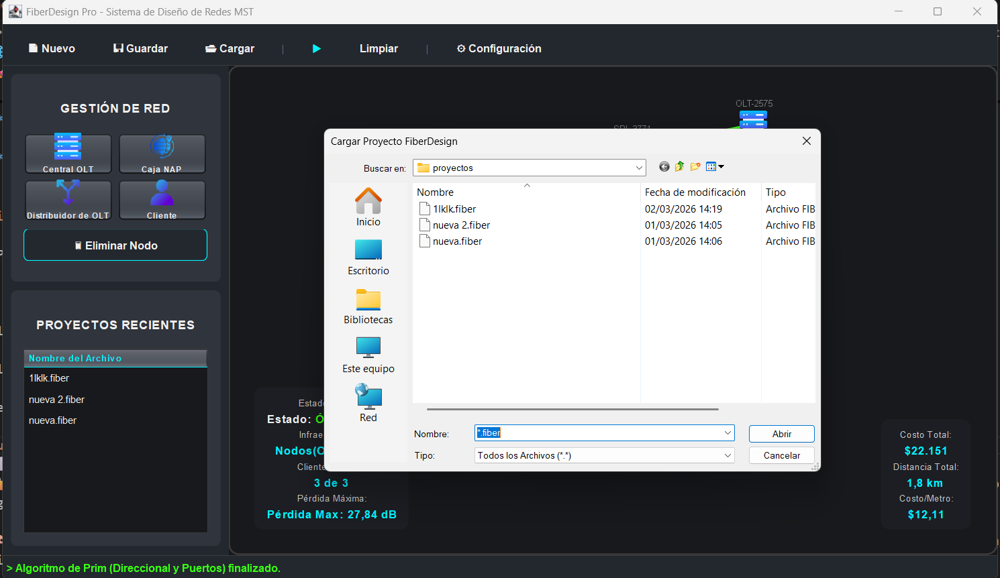

# 🌐 FiberDesign Pro - Sistema de Diseño de Redes FTTH/GPON (MST)

<div align="center">


</div>

---

## 📑 Tabla de Contenidos
- [Demo](#demo)
- [Descripción](#-descripción)
- [Características Clave](#-características-clave)
- [Requisitos Previos](#-requisitos-previos)
- [Instalación y Configuración](#instalación-y-configuración)
- [Estructura del Proyecto](#-estructura-del-proyecto)
- [Guía de Uso Paso a Paso](#-guía-de-uso-paso-a-paso)
- [Notas Adicionales](#-notas-adicionales)
- [Autor](#-autor)
- [Licencia](#-licencia)

---

## Demo 


---

## 📄 Descripción 

Este proyecto es una herramienta de ingeniería de software desarrollada en Java Swing orientada al diseño, simulación y auditoría de redes de fibra óptica (FTTH/GPON). 

El sistema utiliza la teoría de grafos y el **Algoritmo de Prim (Árbol de Expansión Mínima - MST)** para calcular automáticamente las rutas más eficientes para el tendido de cables, reduciendo costos de despliegue mientras evalúa en tiempo real las leyes de la física óptica (atenuación, pérdida por empalmes y división de luz).

> **Nota:** La persistencia de datos se maneja de forma nativa mediante la serialización de objetos en archivos de extensión propia (`.fiber`), manteniendo un entorno portátil y sin bases de datos externas.

### ✨ Características Clave
* 🗺️ **Lienzo Interactivo:** Diseño visual mediante arrastrar y soltar (Drag & Drop) de OLTs, Cajas NAP, Splitters y Clientes.
* 🧠 **Motor de Enrutamiento Inteligente:** Implementación del Algoritmo de Prim adaptado para respetar jerarquías ópticas (direccionalidad de la luz) y límites de puertos físicos.
* 📡 **Telemetría Óptica en Vivo:** Cálculo dinámico de la pérdida de señal (dB) desde la Central hasta el usuario final.
* 💰 **Presupuesto Automatizado:** Estimación instantánea de metros de fibra requeridos y costos de inversión total.
* 🎨 **UI Personalizada (Cyberpunk/Neón):** Interfaz inmersiva.

---

## 📋 Requisitos Previos

Para ejecutar y compilar este proyecto, asegúrate de contar con lo siguiente en tu entorno:

- ☕ Java Development Kit (JDK): Versión 17 o superior.
- 💻 IDE Recomendado: NetBeans, IntelliJ IDEA o Eclipse.
- 🛠️ Gestor de Dependencias: Maven (Estructura nativa del proyecto).
- 🐙 Control de Versiones: Git.

## Instalación y Configuración

### 1. Clonar el repositorio

Abre tu terminal y ejecuta:

```bash
git clone https://github.com/albahir/Dise-ador-de-Redes-Fibra-Optica-MST.git
cd Dise-ador-de-Redes-Fibra-Optica-MST
```
### 2. Importar en el IDE
En NetBeans / IntelliJ / Eclipse:

- Selecciona `File > Open Project` (o `Import`)
- Navega hasta la carpeta raíz clonada.
- El IDE detectará automáticamente la carpeta `src`.

- Navega hasta la carpeta raíz clonada.

- El IDE detectará automáticamente la estructura de Maven (archivo pom.xml).

### 3. Compilación
- Haz clic derecho sobre el proyecto.
- Selecciona `Clean and Build` (Limpiar y Construir).
**Desde terminal (Maven):**
```bash
mvn clean install
```
### 4. Ejecución ▶️
- Localiza la clase principal `ControladorPrincipal.java` dentro del paquete `Controladores` y ejecútala:

- Clic derecho → `Run File`(Ejecutar archivo).

## 📦 Estructura del Proyecto
El sistema respeta estrictamente el patrón de arquitectura Modelo-Vista-Controlador (MVC):
```
FiberDesignPro/
├── src/main/java/
│   ├── Controladores/    # Orquestación de eventos, lógica de guardado y Drag&Drop
│   ├── Modelo/           # Reglas de negocio, Nodos, Enlaces y Algoritmos MST
│   ├── Util/             # Fábrica de Interfaz (UI Neón) y Gestor de Archivos
│   └── Vista/            # Paneles, Lienzo de Dibujo (Graphics2D) y Diálogos
├── src/main/resources/
│   └── icono/            # Assets gráficos y sprites de hardware
├── proyectos/            # Carpeta autogenerada para los archivos .fiber
└── pom.xml               # Configuración de dependencias Maven
```

## 🚀 Guía de Uso Paso a Paso

### 1. Configuración de Parámetros Globales
Antes de diseñar, ajusta la física y economía de tu proyecto desde el botón Configuración.

* **Define el costo por metro de fibra.**

* **Ajusta la pérdida en decibeles (dB) por kilómetro, por empalmes y por conectores.**

* **Establece el umbral máximo de sensibilidad (Ej. 28 dB para GPON Class B+).**




> *Diálogo de parámetros globales controlado por JSpinners seguros.*
---

### 2. Despliegue de Infraestructura (Lienzo)
Utiliza la barra lateral para seleccionar equipos.

* **Haz clic en el mapa para instalar la Central OLT, Distribuidores (Splitters), Cajas NAP y Usuarios Finales.**

* **El sistema previene automáticamente la instalación de múltiples OLTs (Centrales) para mantener la jerarquía de red.**

* **Mueve los equipos libremente por el lienzo (Drag & Drop).**



> *Colocación de hardware en el lienzo oscuro.*
---

### 3. Enrutamiento Inteligente (MST)
Presiona el botón de "Play (▶)" en la barra superior.

* **El Algoritmo de Prim evaluará todas las conexiones posibles en base a la distancia (costo).**

* **Filtrará las conexiones ilegales (ej. un cliente alimentando a una OLT).**

* **Dibujará líneas Neón Verde para los cables definitivos.**



> *Trazado automático de la topología óptima de red.*
---

### 4. Auditoría y Telemetría
Una vez conectada la red, los paneles inferiores cobrarán vida:

* **Telemetría:** Muestra el estado de la red ("ÓPTIMA", "CRÍTICA", "SATURADA"), la pérdida máxima registrada y la cantidad de clientes en línea.

* **Presupuesto:** Calcula el metraje total de cable utilizado y el costo de inversión.

* **Inspectores:** Haz Clic Derecho sobre cualquier Nodo o Cable para abrir una auditoría detallada de puertos y atenuación óptica.




> *Paneles de telemetría y diálogos de información técnica detallada.*
---

### 5. Gestión de Proyectos (.fiber)
Utiliza los botones de "Guardar" y "Cargar" para gestionar tus diseños.

* El sistema guarda el estado exacto del lienzo en archivos personalizados con extensión `.fiber`.

* Selecciona proyectos rápidamente desde la tabla de acceso rápido en el panel lateral.




---

## 📝 Notas Adicionales
- 🔒 Protección de Datos ("Dirty Flag"): El sistema detecta modificaciones en el lienzo y solicita confirmación antes de salir, limpiar o cargar un nuevo archivo para evitar pérdida de progreso.

- 🎨 Renderizado Hardware: Los cables y nodos se dibujan en tiempo real a 60 FPS utilizando la API nativa de Graphics2D de Java Swing con Anti-Aliasing activado.

- 🚫 Sin Base de Datos: Toda la lógica de guardado es 100% portable y serializable.

## 👤 Autor
Desarrollado por Manuel Rodriguez [albahir](user).
- 👨‍💻 Arquitectura MVC construida en Java Swing.
- 👨‍💻 Desarrollado en Java Swing.
---  
## 📜 Licencia
Este proyecto está bajo la licencia [MIT](LICENSE).

Puedes usarlo, modificarlo y distribuirlo libremente, siempre que mantengas la atribución al autor.
